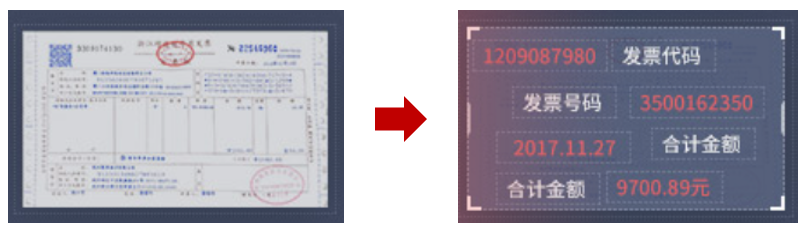

## 智能财税机器人

> 智能创造价值，满足财税全链条需求

- __智能填报机器人__ 

 
告别手工填报 
<!-- 了解详情 -->

通过便捷采集、智能识别、智能审核、智能记账4大功能强化费用管控，开启“财务共享”新时代。

- __智能稽核机器人__ 

强化费用管控 智能创造价值

ksajfjdfa

- __智能核算机器人__ 

 智能自动完成核算工作 解放财会人员双手

ksajfjdfa

## 智能财税解决方案

> 多种行业解决方案，助力企业/行政事业单位快速实现智能化升级

## 独特的智能财税技术

> 自主研发的DUE人工智能引擎，直击财务行业痛点，达到替代财务人员的能力，真正实现“数字员工”

行业领先的OCR引擎，可对票据、文本、复杂表单、二维码等实现全票种、全票面、全字段识别，替代“人眼”，完成财税文档全数字化

